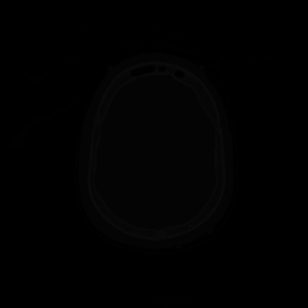
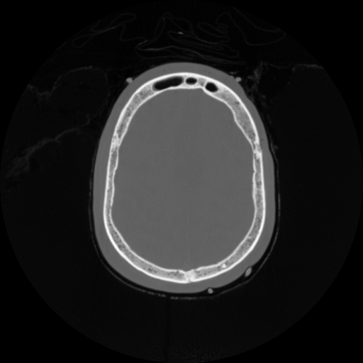
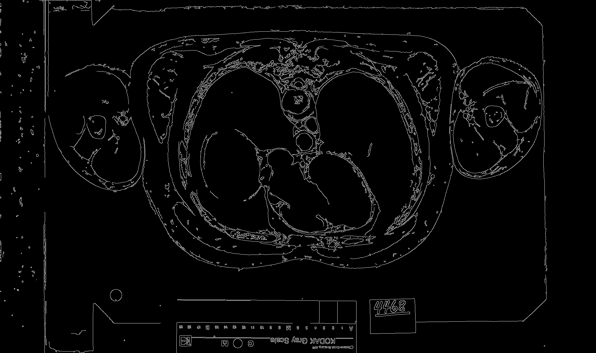
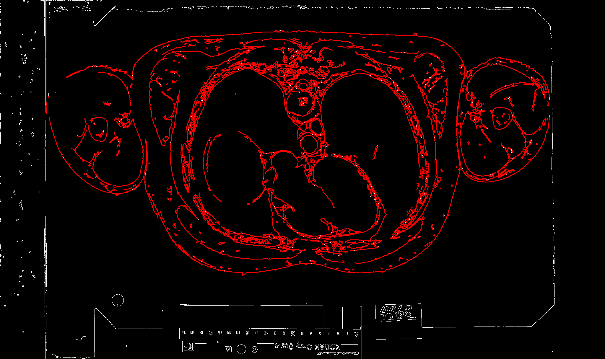
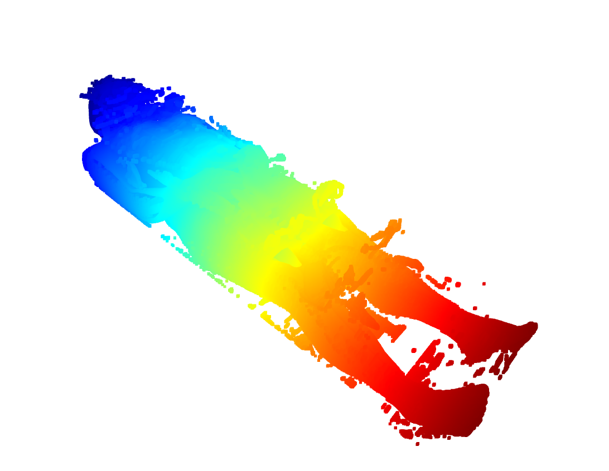
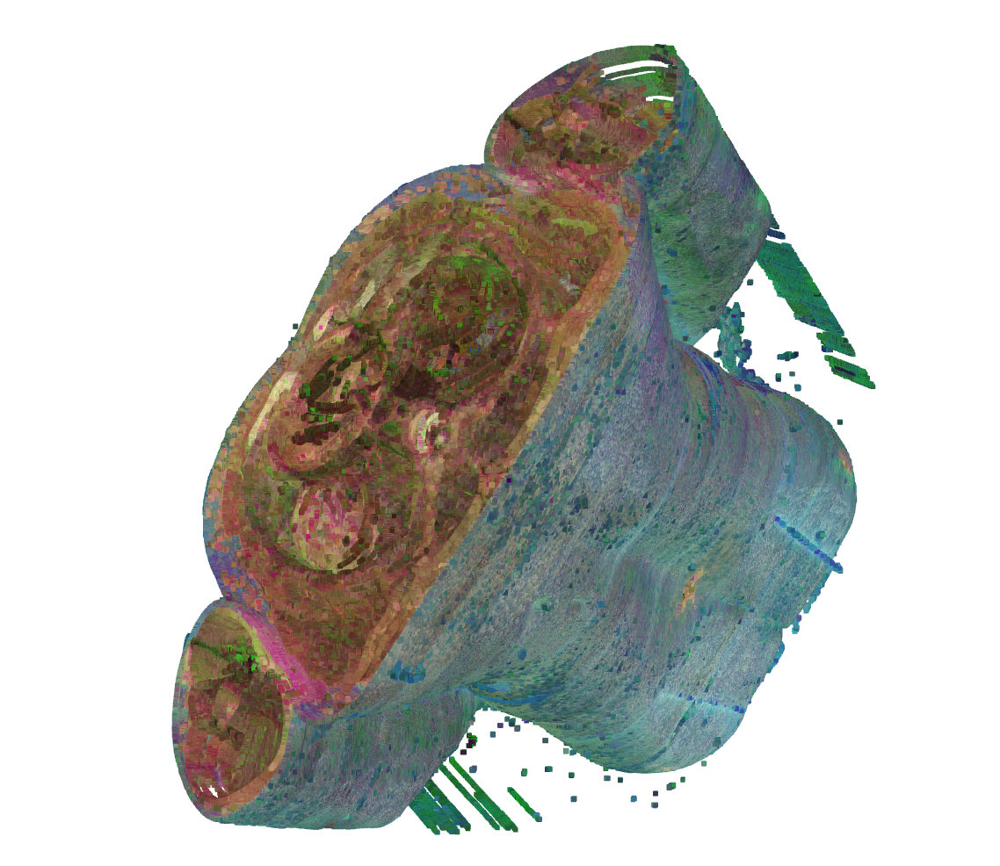

## Tutorial 1: Building 3D models from the Visible Human Project

This tutorial introduces the steps of leveraging the data from the [Visible Human Project](https://www.nlm.nih.gov/research/visible/visible_human.html) (VHP) to generate high-precision 3D models for human body in MedSim3D. 

### Installation

You can install our Python-based MedSim3D toolkit via `pip`:

```
    pip install MedSim3D
```

Most of the function can be accessed through the `MedSim3D` package [[Python Package Home Page]](https://pypi.org/project/MedSim3D/). Be note, due to license, we do not host any original images, but we provide the builder functions to support automated downloading and processing.

### Step 1: Download datasets

The data source of the VHP project is open under its user terms. Anyone can download data through the [website of NLM](https://www.nlm.nih.gov/databases/download/vhp.html). Sample images can be found in [here](https://www.nlm.nih.gov/research/visible/full_color_png.html). 

A sample image of Full Color Anatomical Images can find [here](https://www.nlm.nih.gov/research/visible/image/png_mri/a_vm1125.png):


We firstly use `VHPDownloader` in MedSim3D to different body parts (colorful pictures) or full body's PNG images (MRI/CT images) from the VHP. An example is below: 

```python
from medsim3d.vhp.downloader import VHPDownloader
vhp_downloader=VHPDownloader()
vhp_downloader.download_datasets(gender="Female",
                                 body_part="thorax",
                                 save_folder="datasets/female/thorax")
```

As the above example shows, we download the [thorax part](https://data.lhncbc.nlm.nih.gov/public/Visible-Human/Female-Images/PNG_format/thorax/index.html) of the female human body from the VHP and save the PNG formatted images to the local path ```datasets/female/thorax```. 

The downloading process may take very much time before it is done. 

The options for `gender` is `male` or `female`. 

The options for `body_part` may be `abdomen`, `head`, `legs`, `pelvis`, `thighs`, and `thorax`. 

For CT images from the VHP, we can use the below code to automatically download: 

```python
from medsim3d.vhp.downloader import VHPDownloader
vhp_downloader=VHPDownloader()
vhp_downloader.download_datasets_radiological_CT(gender="Female",
                                                 ct_type="normalCT",
                                                 save_folder="datasets/female/normalCT")
```

The `ct_type` parameter values may be either `normalCT` or `frozenCT`. 

Then, you can also download MRI data from the VHP using the below code: 

```python
from medsim3d.vhp.downloader import VHPDownloader
vhp_downloader=VHPDownloader()
vhp_downloader.download_datasets_radiological_MRI(gender="Female",
                                                  mri_type="mri",
                                                  save_folder="datasets/female/mri")
```

### Step 2: Preprocess the downloaded images

The downloaded CT and MRI images generally cannot be seen by our eyes due to different gray-scale settings. We leverage a function to transform the downloaded images to 12-bit gray scale ones using the below code:

```python
from medsim3d.vhp.radiological_data_converter import *
rdc=RadiologicalDataConverter(dataset_folder="datasets/Female/normalCT")
rdc.convert(save_folder="datasets/Female/normalCT_converted")
```

The above code transformed one folder of PNG images to another folder with name ending with `_converted`. 

A processed image before and after: 

Before conversion:



After conversion:



### Step 3: Retrieve edge information from the images

To build the 3D model, we must retrieve useful point information from the colored PNG human body images that contain many noises. Therefore, an image processing method to retrieve edges from the images is used. The example code by using `EdgeConverter` is below:

```python
from medsim3d.vhp.edge_converter import *

ec=EdgeConverter(dataset_folder="datasets/Female/normalCT_converted")
ec.convert(save_edge_folder="datasets/Female/normalCT_edges",
           save_detected_folder="datasets/Female/normalCT_edges_detected")
```

The `dataset_folder` represents the folder that contains converted images in Step 2. 
The `edge_folder` is the original folder that stores all edge information in images while the `detected` folder stores useful parts of points with in an image that contains much noise at the very beginning. 

Edges:





Finally, we leverage the `...edges_detected` folder's content to generate 3D mdoel. 

### Step 4: Build 3D models

After we obtain the preprocessed data with edge information, we start the process of building models. 

Here is an example of building a Female human body 3D model based on radiological CT image data. 

```python
from medsim3d.vhp.model_builder import  *

mb=ModelBuilder()

gender="Female"

root_path=f"../visible_human/datasets/{gender}-Images/PNG_format/radiological"
# 3. show the normal CT of female
mb.build(
    gender="Female",
    ct_type="normalCT",
    converted_folder=root_path+"/normalCT_converted",
    edge_folder=root_path+"/normalCT_edges",
    detected_folder=root_path+"/normalCT_detected",
    output_model_path="datasets/Female/normalCT.csv"
)
```

We used `normalCT` (or `frozenCT`) type to specify different types of data. the `frozenCT` means the body is scanned after frozen. 

### Step 5: Show the generated 3D model

After we finished building the model in Step 5, we can use our Viewer3D class to view the built 3D model. An example is here: 

```python
from medsim3d.vhp.model_viewer import  *
gender="Male" # Male
ct_type="frozenCT" # frozenCT
mv=ModelViewer(model_csv_file=f'datasets/{gender}/{ct_type}.csv')
mv.convert_to_ply(save_ply_file=f'datasets/{gender}/{ct_type}.ply')
mv.show(ply_file=f'datasets/{gender}/{ct_type}.ply')
```

In the above example, we show the 3D model generated from the male's frozen CT data in the VHP. And then we converted the data into PLY format of 3D model. 





### A pipeline of the human 3D modeling process

We integrate the above steps in the MedSim3D by providing a pipeline to facilitate the process of building the human 3D model. 

```python
from medsim3d.vhp.pipeline_human import *

pipeline_human=PipelineHuman(
    gender='Male',
    ct_type='frozenCT',
    root_path='../datasets/Male/test_frozen'
)

pipeline_human.run(force_download=False)

```

## Building body parts of human body in the VHP

We can leverage the PNG images of different body parts in the VHP to generate 3D body part models. However, the color image of sliced body parts contains plenty of noise that prevents us from building the accurate model. 

Therefore, firstly we leverage an image area point picker to obtain a polygon area that covers useful points in the image. So later we can fetch useful points from the image.

To call the image point picker, we can use the following example: 

```python
from medsim3d.vhp.image_point_picker import *
ipp=ImagePointPicker()
img_path = "../visible_human/datasets/Female-Images/PNG_format/thorax_analysis/edges/avf1405a.png"
ipp.start_to_pick(img_path=img_path,save_points_file='datasets/thorax_polygon_area.pickle')
```

The outputting `save_points_file` is a pickle file that stores a list of points to generate polygon area. 

Then, we use `EdgeConverterWithInPolygon` to extract points in the image given the polygon file. 

Due to their colored images, we can identify the color of points from the original images and render the 3D model with colors. Here we will use the `ModelBuilderWithColor`. 

An example of using the builder is :

```python
from medsim3d.vhp.model_builder_color import *

ec_pg=ModelBuilderWithColor(
    polygon_file='datasets/thorax_polygon_area.pickle',
    dataset_folder='datasets/Female/thorax',
    use_color=True
)

ec_pg.build(body_part='thorax',
              save_edges_folder='datasets/Female/thorax_edges',
              save_detected_folder='datasets/Female/thorax_edges_detected',
              gender='Female',
                output_model_file="datasets/Female/thorax.csv"
            )
```

In the above example, we should set `use_color` true in its initialization. 

After we called the above `build` function, we obtained the model to visualize the 3D body part model by using the following example:

```python
from medsim3d.vhp.model_viewer_color import  *

gender="Female" # Male
body_part="thorax" # frozenCT

mv=ModelViewerColor(model_csv_file=f'datasets/{gender}/{body_part}.csv')

mv.convert_to_ply(save_ply_file=f'datasets/{gender}/{body_part}.ply')

mv.show(ply_file=f'datasets/{gender}/{body_part}.ply')

```

Similarly, we can use the pipeline to automatically generate the model as follows: 

```python
from medsim3d.vhp.pipeline_bodypart import  *
# A pipeline to build body parts in a simple way
pipeline_pelvis=PipelineBodyPart(
    gender="Female",
    body_part="head",
    root_folder='../datasets/Female'
)
pipeline_pelvis.run(force_download=True)
```

A raw example of the built 3D abdomen model of male is below:



