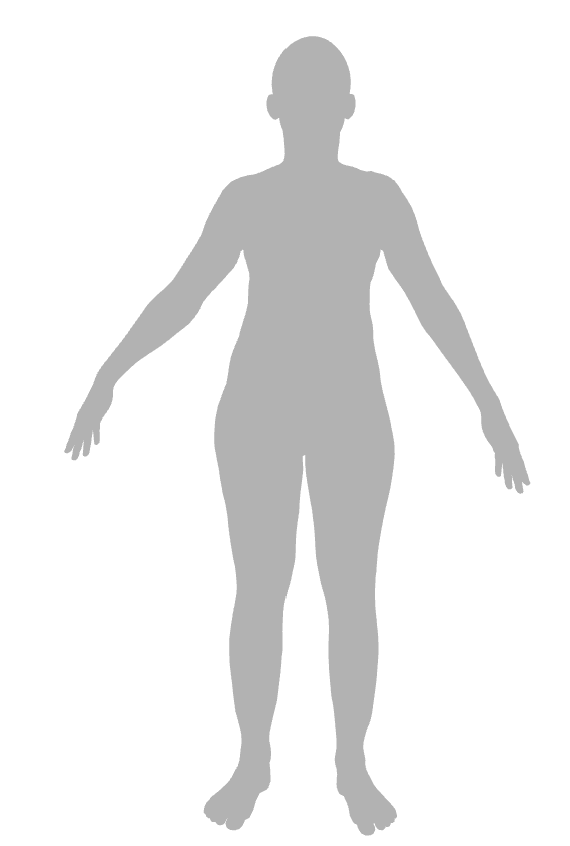

## Tutorial 2: Converting 3D models in different formats

This is a tutorial to demonstrate the MedSim3D framework to leverage various 3D model formats. 

### OBJ file

The Wavefront OBJ format is a most commonly used 3D model format. We implement its simple readers. Please be note the OBJ reader is not perfect and requires improvement. 

Anyway, the example of calling the OBJ reader is: 

```python
from medsim3d.models.obj_reader import *
from medsim3d.models.viewer3d import *
vertices, faces = ObjReader(model_file='datasets/obj/test.obj').read()
Viewer3D().show_triangle_mesh_by_vf(vertices,faces)
```

In the above example, `Viewer3D()` is the 3D model viewer used in MedSim3D, which is built on Open3D. 

An example of reading a 3D model: 



### PLY file

The MedSim3D is also able to read and show PLY files by using `PLYParser` and `Viewer3D` respectively. 

```python
from medsim3d.models.ply_parser import *
from medsim3d.models.viewer3d import Viewer3D
Viewer3D().show_object(obj_file='datasets/ply/test1.ply')
ply_parser=PLYParser(model_file="datasets/ply/test1.ply")
v,f=ply_parser.parse()
Viewer3D().show_triangle_mesh_by_vf(v,f)
```

### OFF file

The Object File Format (OFF) can be read by `OFFReader` as like:

```python
from medsim3d.models.off_reader import OFFReader
from medsim3d.models.viewer3d import Viewer3D

# Example 1:
v,f = OFFReader(model_file='datasets/off/bathtub_0001.off').read()
Viewer3D().show_triangle_mesh_by_vf(vertices=v,faces=f)

# Example 2:
Viewer3D().show_object(obj_file='datasets/off/bathtub_0001.off')
```

If you want to write as OFF file from the obtained vertices and faces, then we have an exmaple:

```python
from medsim3d.models.off_writer import *
from medsim3d.models.off_reader import OFFReader
from medsim3d.models.viewer3d import Viewer3D
v,f = OFFReader(model_file='datasets/off/bathtub_0001.off').read()
OFFWriter(model_file='datasets/off/bathtub-generated.off',vertices=v,faces=f).write()
v1,f1 = OFFReader(model_file='datasets/off/bathtub-generated.off').read()
Viewer3D().show_triangle_mesh_by_vf(vertices=v,faces=f)
```

The above example shows that `v` and `f` are vertices and faces respectively. Then we can use `Viewer3D` to display the model.

### MAT file 

MAT files are usually used in Matlab. Considering some 3D models are stored as MAT file, we provide the MAT converter and creator to support MAT file reading and writing. Here is an example of reading MAT file. 

```python
from medsim3d.models.mat_converter import *

mc=MatConverter(mat_path='datasets/mat/Male.mat')
mc.convert(output_csv_file='datasets/mat/Male.csv',
           output_ply_file='datasets/mat/Male.ply',
           output_v_file='datasets/mat/Male.points.pickle',
           output_f_file='datasets/mat/Male.faces.pickle',
           cube_len=64,threshold=0.5
           )

mc.show(ply_file='datasets/mat/Male.ply',)

mc.show_triangle_mesh(v_file='datasets/mat/Male.points.pickle',
          f_file='datasets/mat/Male.faces.pickle',)
```

The above converter reads a MAT file and converts it into several formats such as `.csv`, `.ply` and `.pickle` files. Then we can show the model using `Viewer3D()`. 

We can also create MAT file from given vertices and faces read from other files. Here is an example. 

```python
from medsim3d.models.mat_creator import MatCreator
from medsim3d.models.viewer3d import *

MatCreator(point_csv_file='datasets/mat/Male.csv').create(
    save_mat_path='datasets/mat/Male-generated.mat')

Viewer3D().show_mat_file(mat_file='datasets/mat/Male-generated.mat')

Viewer3D().show_triangle_mesh(mat_file='datasets/mat/Male-generated.mat')

```

### CSV file

CSV file is a most used file format to store point information obtained from 3D models. Generally, the CSV format is:
```
id,x,y,z,r,g,b
```

or without color information:
```
id,x,y,z
```

In the future, we will ignore the `id` field and just store useful information since the `id` fiel can be inferred by its line number. 

```
x,y,z
```

We have our implemented `PointCSVReader` class to serve this purpose. 

### Note

Each 3D format should be exchanged without problem in MedSim3D. 


