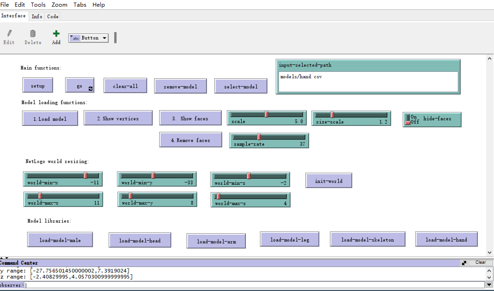
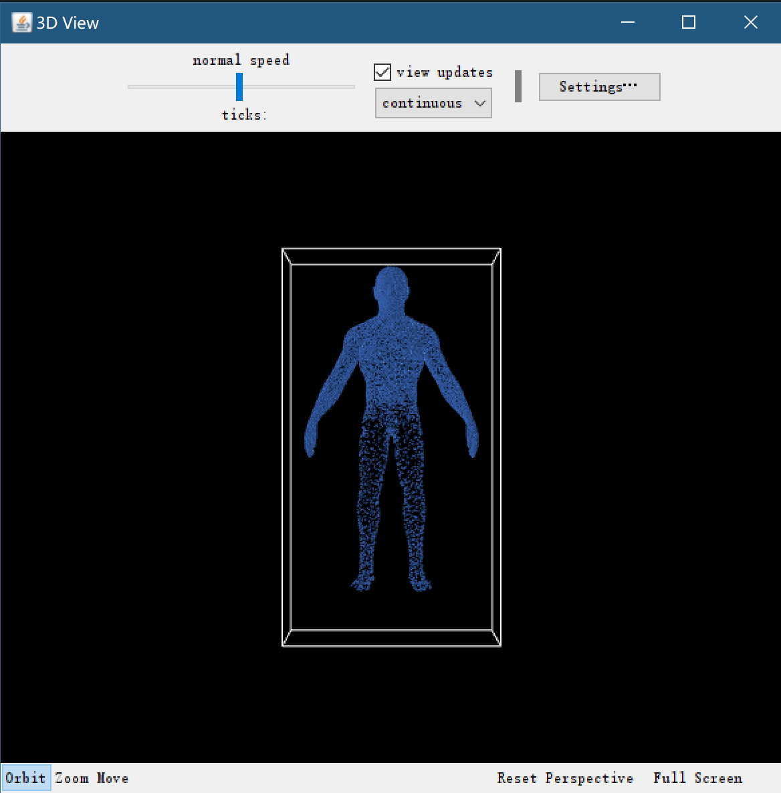

## Tutorial 3: Building NetLogo 3D models for human body-related simulation

This tutorial shows how to import 3D models into NetLogo 3D world to utilize the ability of agent-based modeling in medical education.

### 1. What models can be used in NetLogo 3D? 

First, many 3D model formats can be read by MedSim3D and the provided NetLogo 3D applications. The format includes .obj, .ply, .csv, .off and mat files. 

There are something that should be addressed. When reading the 3D file with polygon, we should convert polygon faces to a series of triangle faces so as to easily render in the NetLog and exchange with other formats. 

Here is an example: 
```python
def tripoly(poly):
    return [(poly[0],b,c) for b,c in zip(poly[1:],poly[2:])]
polygon=[1, 2, 3, 4 ,5]
print(tripoly(polygon)) 
```

Regarding the file format conversion, the `.obj` file can be transformed into `.off` files. Here is an example:

```python
from medsim3d.models.obj_parser import ObjRawParser
from medsim3d.models.viewer3d import Viewer3D
if __name__=="__main__":
    obj_parser=ObjRawParser(model_file="models/male.obj")
    obj_parser.parse(to_triangle_mesh=True)

    # Example 1:
    # obj_parser.save_to_pointcloud(ply_file='outputs/male-pointcloud.ply')
    # Viewer3D().show_point_cloud(ply_file='outputs/male-pointcloud.ply')

    # Example 2:
    obj_parser.save_to_off(save_off_file='outputs/male.off')
    Viewer3D().show_object(obj_file="outputs/male.off")
```

### 2. Run NetLogo 3D in MedSim3D

The MedSim3D integrates a general NetLogo 3D application to read various 3D files and create agent-based models for each model with powerful agent-based abilities. 

The Python-based MedSim3D framework is able to run the installed NetLogo 3D (version: 6.2.1 as we used) using code-lever and GUI-level methods. 

Here is a neat example of calling our NetLogo 3D application. 

```python
from medsim3d.netlogo.simulator3d import *
sim3d=NetLogo3DSim(netlogo_model_name="MedSim3D-0.0.1a.nlogo3d")
sim3d.run_model_male()
```

The version num `0.0.1a` should increase like `0.0.1a3`...

A screenshot of the NetLogo 3D application: 



A screenshot of the 3D view in NetLogo 3D: 



### 3. Determine optimal settings of parameters needed to render 3D models in MedSim3D

An example is below:
```python
from medsim3d.netlogo.simulator3d import *
sim3d=NetLogo3DSim(netlogo_model_name="MedSim3D-0.0.1a1.nlogo3d")
config_model=sim3d.predict_3dworld_size(model_path="netlogo-models/models/male.off")
print(config_model)
```

An output is below:
```
{'scale': 14.29, 'offset-x': -14, 'offset-y': 21, 'offset-z': -21, 'sample-rate': 17, 
'size-scale': 1.2, 'world-min-x': -28, 'world-max-x': 37, 
'world-min-y': -65, 'world-max-y': 55, 'world-min-z': -4, 'world-max-z': 13}
```

### 4. A full example including parameter estimation and modeling running

The configuration model is used to in NetLogo application model. A full example is here:

```python
from medsim3d.netlogo.simulator3d import *
# model file
model_file='../examples-med3dsim/datasets/Female/pelvis.ply'
# init a model
sim3d=NetLogo3DSim(netlogo_model_name="MedSim3D-0.0.1a2.nlogo3d")
# path conversion
abs_path=os.path.abspath(model_file)
abs_path = abs_path.replace("\\", "/")
config_model=sim3d.predict_3dworld_size(model_path=abs_path)
print(config_model)

config_model["world-min-z"]=-5
config_model["world-max-z"]=5
# Input the configuration of parameters into NetLogo 3D model. 
sim3d.run_model(model_path=abs_path,
                scale=config_model["scale"],
                size_scale=config_model["size-scale"],
                sample_rate=config_model["sample-rate"],
                offset_x=config_model["offset-x"],
                offset_y=config_model["offset-y"],
                offset_z=config_model["offset-z"],
                world_min_x=config_model["world-min-x"],
                world_max_x=config_model["world-max-x"],
                world_min_y=config_model["world-min-y"],
                world_max_y=config_model["world-max-y"],
                world_min_z=config_model["world-min-z"],
                world_max_z=config_model["world-max-z"],
                auto_world_resize=True
                )
```

### 5. Building NetLogo 3D model

This model has been built and included in our PyPI release. This section illustrates the key NetLogo procedures we used to build the model.

#### Step 1: model importing

In the NetLogo 3D model, we implement various 3D formated readers that support reading .obj, .ply, .off, .csv file formats. 

Below are source codes of the readers in NetLogo language. 


- Read CSV file of 3D model

```
    ; load csv file with points (id,x,y,z)
to load-csv-file-common [obj-file auto-world-resize]
  set vertices []
  set vertices-n []
  set vertices-t []
  set vertices-color []
  set faces []
  set faces-vn []
  set faces-vt []
  let split-str " "
  let v-count 0

    set max_x -10000
  set min_x 10000
  set max_y -10000
  set min_y 10000
  set max_z -10000
  set min_z 10000

   ; open the csv file
  file-open obj-file
  let header csv:from-row file-read-line
  while [ not file-at-end? ] [
    let row csv:from-row file-read-line
    ifelse v-count mod sample-rate != 0 [ ; use a point per sample-rate
      ; get a point per the value of sample-rate points
    ]
    [
    ; print(row)
    ; read points (x,y,z)
    if length row = 4 [
    let x item 1 row * scale + offset-x
    let y item 2 row * scale + offset-y
    let z item 3 row * scale + offset-z
    ; add vertices
       set vertices lput (list x y z v-count) vertices

          ; identify world size
    if x > max_x [ set max_x x]
    if x < min_x [ set min_x x]
    if y > max_y [ set max_y y]
    if y < min_y [ set min_y y]
    if z > max_z [ set max_z z]
    if z < min_z [ set min_z z]

      ]
      if length row >= 7[
            let x item 1 row * scale + offset-x
    let y item 2 row * scale + offset-y
    let z item 3 row * scale + offset-z
    ; add vertices
       set vertices lput (list x y z v-count) vertices

        let r item 4 row
        let g item 5 row
        let b item 6 row
        set vertices-color lput (list r g b) vertices-color

          ; identify world size
    if x > max_x [ set max_x x]
    if x < min_x [ set min_x x]
    if y > max_y [ set max_y y]
    if y < min_y [ set min_y y]
    if z > max_z [ set max_z z]
    if z < min_z [ set min_z z]

      ]


    ]

    set v-count v-count + 1

  ]
  file-close


  print (word "vertices: " length vertices ", faces: " length faces)
  print (word "faces-vn: " length faces-vn ", faces-vt: " length faces-vt)


   if auto-world-resize = true [
       if min_x > 0 [set min_x 0]
    if max_x < 0 [set max_x 0]
    if min_y > 0 [set min_y 0]
    if max_y < 0 [set max_y 0]
    if min_z > 0 [set min_z 0]
    if max_z < 0 [set max_z 0]

       print "World Size:"
  print (word "x range: ["   min_x "," max_x "]")
  print (word "y range: ["   min_y "," max_y "]")
  print (word "z range: ["   min_z "," max_z "]")

    set world-min-x int (min_x * size-scale)
    set world-max-x int  (max_x  *  size-scale )
    set world-min-y int (min_y *  size-scale )
    set world-max-y int (max_y  *  size-scale)
    set world-min-z int (min_z *  size-scale )
    set world-max-z int (max_z *  size-scale )


     ifelse world-max-x > 60 or world-max-y > 60 or world-max-z > 60 or world-min-x < -60 or world-min-y < -60 or world-min-z < -60  [
      user-message "world size may be too large? We have stopped resizing world size. you can manually set the world size!"
    ][
       resize-world world-min-x world-max-x  world-min-y  world-max-y    world-min-z   world-max-z
    ]
  ]

end
```
- Read PLY file of 3D model

```

; load .ply 3D model file
to load-ply-file-common [obj-file auto-world-resize]
  ; set obj-file "models/teapot.off"
  set vertices []
  set vertices-n []
  set vertices-t []
  set vertices-color []
  set faces []
  set faces-vn []
  set faces-vt []
  let split-str " "

  set max_x -10000
  set min_x 10000
  set max_y -10000
  set min_y 10000
  set max_z -10000
  set min_z 10000

  print obj-file
  file-open obj-file
  let line ""
  let num_vertex 0
  let num_face 0
  let num_edge 0
  ; file-close
  set line file-read-line
  while [line != "end_header"  and not file-at-end?][

    let ls (csv:from-row line split-str)
    if item 0 ls = "element" [
      if item 1 ls = "vertex" [ set num_vertex item 2 ls ]
      if item 1 ls = "face" [set num_face item 2 ls ]
      if item 1 ls = "edge" [set num_edge item 2 ls ]

    ]
    set line file-read-line
  ]

  let v-count 0
  while [v-count < num_vertex]
  [
     set line file-read-line
    ; print(line)
     let ls (csv:from-row line split-str)
     if length ls = 3 [
      let x item 0 ls
      let y item 1 ls
      let z item 2 ls

        ifelse v-count mod sample-rate != 0 [ ; use a point per sample-rate

    ][
         set vertices lput (list x y z v-count) vertices
      ]

         ; identify world size
    if x > max_x [ set max_x x]
    if x < min_x [ set min_x x]
    if y > max_y [ set max_y y]
    if y < min_y [ set min_y y]
    if z > max_z [ set max_z z]
    if z < min_z [ set min_z z]

    ]
    if length ls = 6 [
           let x item 0 ls * scale + offset-x
      let y item 1 ls * scale + offset-x
      let z item 2 ls * scale + offset-x
           let r item 3 ls
      let g item 4 ls
      let b item 5 ls
         ifelse v-count mod sample-rate != 0 [ ; use a point per sample-rate

    ][
          set vertices lput (list x y z v-count) vertices
          set vertices-color lput (list r g b v-count) vertices-color
      ]

              ; detect world size
     if x > max_x [ set max_x x]
    if x < min_x [ set min_x x]
    if y > max_y [ set max_y y]
    if y < min_y [ set min_y y]
    if z > max_z [ set max_z z]
    if z < min_z [ set min_z z]

    ]


    tick
    set v-count v-count + 1

  ]
  set v-count 0
  while [ v-count < num_face][
    set line file-read-line
    ; print(line)
    let ls (csv:from-row line split-str)
    let i 1
    let tris []
    while [i < length ls - 2][
      let p1 item 1 ls
      let p2 item (i + 1) ls
      let p3 item (i + 2) ls

      let tri (list p1 p2 p3)
      ; set tris lput tri tris
      set faces lput tri faces
      set i i + 1
     ; print tri
    ]

   set v-count v-count + 1
  ]


  print (word "vertices: " length vertices ", faces: " length faces)
  print (word "faces-vn: " length faces-vn ", faces-vt: " length faces-vt)

  ; print (word "stat: " num_vertex "," num_face "," num_edge)

  file-close

    if auto-world-resize = true [
       if min_x > 0 [set min_x 0]
    if max_x < 0 [set max_x 0]
    if min_y > 0 [set min_y 0]
    if max_y < 0 [set max_y 0]
    if min_z > 0 [set min_z 0]
    if max_z < 0 [set max_z 0]

       print "World Size:"
  print (word "x range: ["   min_x "," max_x "]")
  print (word "y range: ["   min_y "," max_y "]")
  print (word "z range: ["   min_z "," max_z "]")

    set world-min-x int (min_x * size-scale)
    set world-max-x int  (max_x  *  size-scale )
    set world-min-y int (min_y *  size-scale )
    set world-max-y int (max_y  *  size-scale)
    set world-min-z int (min_z *  size-scale )
    set world-max-z int (max_z *  size-scale )


     ifelse world-max-x > 60 or world-max-y > 60 or world-max-z > 60 or world-min-x < -60 or world-min-y < -60 or world-min-z < -60  [
      user-message "world size may be too large? We have stopped resizing world size. you can manually set the world size!"
    ][
       resize-world world-min-x world-max-x  world-min-y  world-max-y    world-min-z   world-max-z
    ]
  ]

end
```

- Read OFF file of 3D model

```
   
; load .off 3D model file
to load-off-file-common [obj-file auto-world-resize]

  ; set obj-file "models/teapot.off"
  set vertices []
  set vertices-n []
  set vertices-t []
  set vertices-color []
  set faces []
  set faces-vn []
  set faces-vt []
  let split-str " "

  file-open obj-file
  print obj-file

  set max_x -10000
  set min_x 10000
  set max_y -10000
  set min_y 10000
  set max_z -10000
  set min_z 10000

  let v-count 0
  let file-flag file-read-line
  print file-flag
  let num-str file-read-line
  let nums (csv:from-row num-str split-str)
  let num-vertices item 0 nums
  let num-faces item 1 nums
  let num-edges item 2 nums

  let line-num 0

  while [line-num < num-vertices] [
     let line file-read-line
    let ls (csv:from-row line split-str)
     let x (item 0 ls) * scale + offset-x
       let y (item 1 ls) * scale + offset-y
       let z (item 2 ls) * scale + offset-z

    ifelse v-count mod sample-rate != 0 [
    ;  set vertices lput [] vertices
    ][
      set vertices lput (list x y z v-count) vertices

    ]
     set v-count v-count + 1

     set line-num line-num + 1

          ; detect world size
     if x > max_x [ set max_x x]
    if x < min_x [ set min_x x]
    if y > max_y [ set max_y y]
    if y < min_y [ set min_y y]
    if z > max_z [ set max_z z]
    if z < min_z [ set min_z z]

tick

  ]

  set line-num 0
  while [line-num < num-faces]
  [
      let line file-read-line
       let ls (csv:from-row line split-str)
     let x (item 1 ls)
       let y (item 2 ls)
       let z (item 3 ls)
      set faces lput (list x y z) faces
    set line-num line-num + 1
  ]

 print (word "vertices: " length vertices ", faces: " length faces)
 file-close


  print (word "vertices: " length vertices ", faces: " length faces)
  print (word "faces-vn: " length faces-vn ", faces-vt: " length faces-vt)

 if auto-world-resize = true [
       if min_x > 0 [set min_x 0]
    if max_x < 0 [set max_x 0]
    if min_y > 0 [set min_y 0]
    if max_y < 0 [set max_y 0]
    if min_z > 0 [set min_z 0]
    if max_z < 0 [set max_z 0]

       print "World Size:"
  print (word "x range: ["   min_x "," max_x "]")
  print (word "y range: ["   min_y "," max_y "]")
  print (word "z range: ["   min_z "," max_z "]")

    set world-min-x int (min_x * size-scale)
    set world-max-x int  (max_x  *  size-scale )
    set world-min-y int (min_y *  size-scale )
    set world-max-y int (max_y  *  size-scale)
    set world-min-z int (min_z *  size-scale )
    set world-max-z int (max_z *  size-scale )


     ifelse world-max-x > 60 or world-max-y > 60 or world-max-z > 60 or world-min-x < -60 or world-min-y < -60 or world-min-z < -60  [
      user-message "world size may be too large? We have stopped resizing world size. you can manually set the world size!"
    ][
       resize-world world-min-x world-max-x  world-min-y  world-max-y    world-min-z   world-max-z
    ]
  ]


end
```

- Read OBJ file of 3D model

```

; load 3D obj file from local file system
to load-obj-file-common [obj-file auto-world-resize]
  ; let obj-file "models/teapot.obj"
  let split-str " "
  set vertices []
  set vertices-n []
  set vertices-t []
  set vertices-color []
  set faces []
  set faces-vn []
  set faces-vt []  set vertices []
  set vertices-n []
  set vertices-t []
  set vertices-color []
  set faces []
  set faces-vn []
  set faces-vt []

  set max_x -10000
  set min_x 10000
  set max_y -10000
  set min_y 10000
  set max_z -10000
  set min_z 10000
  let v-count 0
  file-open obj-file
  while [not file-at-end?][
    let line file-read-line
    let test-line remove "" line

    ; print line
    let ls (csv:from-row line split-str)
    if length ls >= 3 and (item 0 ls != "#") and test-line != "" [
    ; print ls
    let flag item 0 ls
    if flag = "v" and length ls >= 4 [
       let x (item 1 ls) * scale + offset-x
       let y (item 2 ls) * scale + offset-y
       let z (item 3 ls) * scale + offset-z

     ifelse v-count mod sample-rate != 0 [
     ; set vertices lput (list 0) vertices
    ][
      set vertices lput (list x y z v-count) vertices

    ]
        set v-count v-count + 1
        ; detect world size
     if x > max_x [ set max_x x]
    if x < min_x [ set min_x x]
    if y > max_y [ set max_y y]
    if y < min_y [ set min_y y]
    if z > max_z [ set max_z z]
    if z < min_z [ set min_z z]

    ]
      if flag = "vn" and length ls >= 4 [
       let x (item 1 ls)
       let y (item 2 ls)
       let z (item 3 ls)
      set vertices-n lput (list x y z) vertices-n
    ]

    if flag = "f"[
      let list-f []
      let list-fvt []
      let list-fvn []
      let n length ls
        ifelse member? "/" line [ ; contains vn, vt
             let current-i 1
        while [current-i < n ] [

            let vs (csv:from-row (item current-i ls) "/")
            if length vs >= 3 [
            ; print(vs)
            let fv item 0 vs
            let fvn item 1 vs
            let fvt item 2 vs
             set list-f lput fv list-f
             set list-fvn lput fvn list-fvn
             set list-fvt lput fvt list-fvt

            ]
            set current-i current-i + 1
          ]
           set faces lput list-f faces
           set faces-vn lput list-fvn faces-vn
          set faces-vt lput list-fvt faces-vt

          ]

          [ ; only vertice index
      let current-i 1
        while [current-i < n ] [

        let f item current-i ls

        set list-f lput f list-f
            set current-i current-i + 1
          ]


      set faces lput list-f faces
        ]
    ]
    ]
    tick
  ]
  file-close


  print (word "vertices: " length vertices ", faces: " length faces)
  print (word "faces-vn: " length faces-vn ", faces-vt: " length faces-vt)

 if auto-world-resize = true [
       if min_x > 0 [set min_x 0]
    if max_x < 0 [set max_x 0]
    if min_y > 0 [set min_y 0]
    if max_y < 0 [set max_y 0]
    if min_z > 0 [set min_z 0]
    if max_z < 0 [set max_z 0]

       print "World Size:"
  print (word "x range: ["   min_x "," max_x "]")
  print (word "y range: ["   min_y "," max_y "]")
  print (word "z range: ["   min_z "," max_z "]")

    set world-min-x int (min_x * size-scale)
    set world-max-x int  (max_x  *  size-scale )
    set world-min-y int (min_y *  size-scale )
    set world-max-y int (max_y  *  size-scale)
    set world-min-z int (min_z *  size-scale )
    set world-max-z int (max_z *  size-scale )


     ifelse world-max-x > 60 or world-max-y > 60 or world-max-z > 60 or world-min-x < -60 or world-min-y < -60 or world-min-z < -60  [
      user-message "world size may be too large? We have stopped resizing world size. you can manually set the world size!"
    ][
       resize-world world-min-x world-max-x  world-min-y  world-max-y    world-min-z   world-max-z
    ]
  ]


end
```

#### Step 2: Create vertices and faces in NetLogo 3D

Here is the source code of creating vertices read from 3D models

```
; create vertices of the 3D model into agent-based model
to create-vertices

  clear-model

  let n length vertices
  let i 0
  while [i < n] [
   let vertice item i vertices
   if length vertice = 4[
      ;
      ; print(vertice)
      let mycolor blue
      if length vertices-color != 0 and i <= n - 1[
        let c item i vertices-color
        let r item 0 c
        let g item 1 c
        let b item 2 c
        set mycolor (list r g b)
      ]
     ; print (word mycolor)
   create-turtles 1 [
     set shape "dot"
       set color mycolor
        let x item 0 vertice
        let y item 1 vertice
        let z item 2 vertice

      setxyz x y z
      set size turtle-size
      set vid (item 3 vertice)
      set object "model"
     ]
    ]
   set i i + 1
  ]

end
```

And we can create faces. However, the face is created by linking three points, not real faces. 

```

; create links between agents
to create-faces
  let n length faces
  let i 0
  while [i < n] [
    let f item i faces
    ; print f
    let p1 one-of (turtles with [object = "model" and vid = item 0 f])
    let p2 one-of (turtles with [object = "model" and vid = item 1 f])
    let p3 one-of (turtles with [object = "model" and vid = item 2 f])
    ifelse p1 != nobody and p2 != nobody and p3 != nobody [
      draw-triangle p1 p2 p3 i

    ][
      ; print (word f)
    ]
    set i i + 1
  ]
end
```

#### Step 3: Load 3D model with pre-defined parameters

We integrate several human body part models pre-built with pre-defined parameters. For example, like head, arm, skeleton, hand, and human full body models. 

The NetLogo procedures with pre-defined parameters are shown as follows: 

```


to load-model-male
  set scale 10
  set sample-rate 30
  set size-scale 1.5
   load-model-auto "models/male.csv" -22 22 -66 17 -5 9

end


to load-model-head
  set scale 10
  set size-scale 1.5
  set sample-rate 10
  load-model-auto "models/head.csv"  -4 4 0 19 -3 8

end

to load-model-hand
  set scale 0.3
  set size-scale 1.5
  set sample-rate 10
  load-model-auto "models/hand.csv" -43 27 -34 47 -1 20

end

to load-model-arm
  set scale 0.3
  set size-scale 1.5
  set sample-rate 2
  load-model-auto "models/arm.csv" -18 55 -24 24 -53 109

end

to load-model-skeleton
  set scale 0.05
  set size-scale 1.5
  set sample-rate 50
  load-model-auto "models/human-skeleton.csv" -11 15 -22 22 -60 64

end

to load-model-leg
  set scale 0.8
  set size-scale 1.5
  set sample-rate 1
  load-model-auto "models/leg.csv" -9 12 0 118 -17 18

end
```

## 

The process of the entire NetLogo 3D model is:

Step 0: prepare for several .obj, .csv or .off 3D model files.

Step 1: select model

Step 2: load model

Step 3: show vertices

Step 4: show/remove faces

Step 5: run a simple sample simulation procedure that randomly visits neighbor agent sets in the 3D model for demonstration. 


### 6. Our other work around agent-based 3D modeling

- [AB3DMT: Agent-based 3D modeling toolkit ](https://github.com/dhchenx/AB3DMT)
- [3D model loading with CSV files](http://modelingcommons.org/browse/one_model/7047#model_tabs_browse_info)
- [3D model scanning](http://modelingcommons.org/browse/one_model/7048#model_tabs_browse_info)

