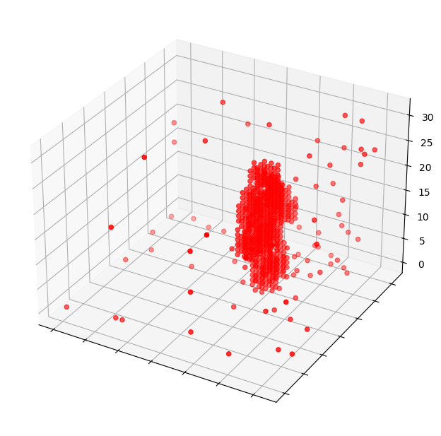
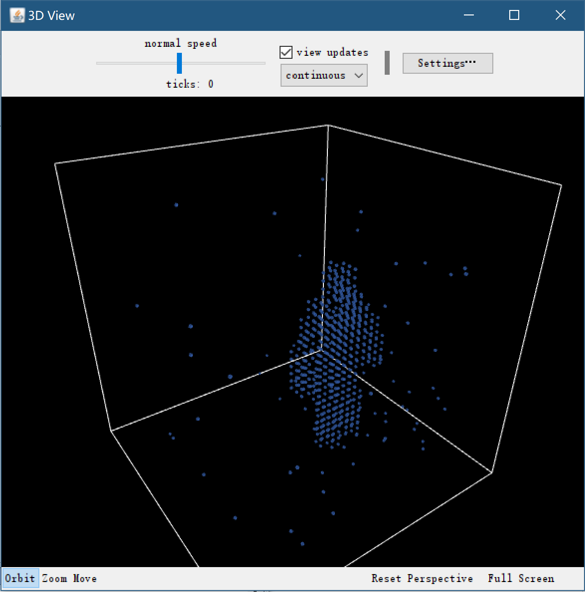

## Tutorial 4: Deep learning-based 3D modeling and simulation 

We leverage deep learning-based methods to facilitate the 3D modeling process. Here we present several deep learning methods to utilize in MedSim3D.

### 1. GAN-based 3D model generation and NetLogo simulation

First, MedSim3D used the 3DGAN architecture to generate 3D point clouds after training from many similar models. And then the generated 3D model can be imported into NetLogo 3D. 

#### Step 1: Training

Here is an example of training based on 3DGAN

```python
from medsim3d.deeplearning.gan3d.gan3d_core import GAN3D
from medsim3d.deeplearning.gan3d.gan3d_parameters import GAN3DParameters

if __name__ == '__main__':
    # 1. define 3DGAN parameters, especially for data_dir, model_dir and output_dir
    gan3d_params=GAN3DParameters(
        epochs=500,
        data_dir="datasets/",
        model_dir="Male/",
        output_dir="outputs",
        middle_dir="30/"
    )
    # 2. Construct the 3DGAN model and train
    gan3d = GAN3D(

        logs_folder="test1",
        model_name="dcgan",
        use_visdom=True,
        params=gan3d_params
    )

    # 3. start the server: python -m visdom.server

    # 4. start to train
    gan3d.start()

```

We can determine the settings of parameters in the 3DGAN model in `GAN3DParameters`. 

#### Step 2: Test and evaluation

Then we can evaluate the trained model. 

```python
from medsim3d.deeplearning.gan3d.gan3d_core import GAN3D
from medsim3d.deeplearning.gan3d.gan3d_parameters import GAN3DParameters

if __name__ == '__main__':
    # 1. define 3DGAN parameters, especially for data_dir, model_dir and output_dir
    gan3d_params=GAN3DParameters(
        epochs=500,
        data_dir="datasets/",
        model_dir="Male/",
        output_dir="outputs",
        images_dir="test_outputs",
        points_dir="test_points",
        testN=10
    )
    # 2. Construct the 3DGAN model and test by setting parameter test=True
    gan3d = GAN3D(
        logs_folder="test1",
        model_name="dcgan",
        use_visdom=True,
        params=gan3d_params,
        test=True
    )

    # 3. start the server: python -m visdom.server

    # 4. start to train
    gan3d.start()

```

An output 3D model's image:



#### Step 3: Import generated 3D models into NetLogo 3D using our NetLogo 3D integration in MedSim3D. 

```python
from medsim3d.netlogo.simulator3d import *

model_file='outputs/dcgan/test1/test_points/tester_0.csv'

sim3d=NetLogo3DSim(netlogo_model_name="MedSim3D-0.0.1a2.nlogo3d")

abs_path=os.path.abspath(model_file)
abs_path = abs_path.replace("\\", "/")

config_model=sim3d.predict_3dworld_size(model_path=abs_path)

print(config_model)

sim3d.run_model(model_path=abs_path,
                scale=config_model["scale"],
                size_scale=config_model["size-scale"],
                sample_rate=config_model["sample-rate"],
                offset_x=config_model["offset-x"],
                offset_y=config_model["offset-y"],
                offset_z=config_model["offset-z"],
                world_min_x=config_model["world-min-x"],
                world_max_x=config_model["world-max-x"],
                world_min_y=config_model["world-min-y"],
                world_max_y=config_model["world-max-y"],
                world_min_z=config_model["world-min-z"],
                world_max_z=config_model["world-max-z"],
                auto_world_resize=True
                )

```


Finally, the deep learning-based models can be imported into NetLogo 3D worlds for agent-based modeling adn simulation.

The generated 3D model imported into NetLogo 3D:

