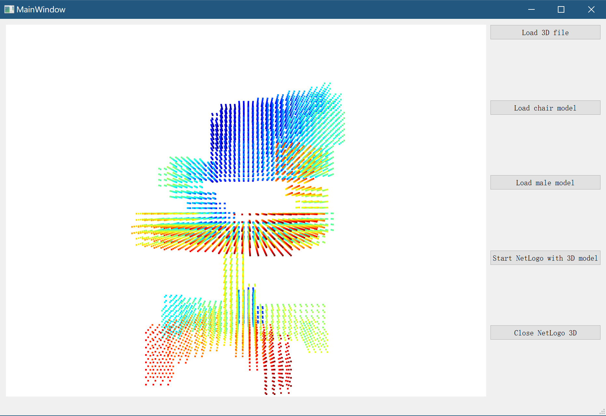

## Tutorial 5: Graphical User Interface (GUI) for MedSim3D

This section illustrates our developing GUI applications for various models and functions in MedSim3D. 

### 1. GUI for 3D models 

We developed a 3D viewer for users to view the 3D models with various format. The Open3D framework provides us with power abilities to read and display the 3D models. 

We can call the viewer in the following example: 

```python
from medsim3d.gui.gui_viewer3d import GUIViewer3DApp
if __name__ == "__main__":
   GUIViewer3DApp()
```

The function of `GUIViewer3DApp()` includes:

- Load 3D file
- Load chair model
- Load male model
- Start NetLogo with 3D model (import the loaded 3D model into NetLogo 3D)
- Close NetLogo 3D

A screenshot of `GUIViewer3DApp()`: 



### 2. GUI for human full body viewer

The GUI application for human full body viewer can display the human body model from the VHP. 

Here is an example to call this viewer:

```python
from medsim3d.gui.gui_human_viewer3d import GUIHuman3DViewerApp
if __name__ == "__main__":
   GUIHuman3DViewerApp()
```

The functions of the `GUIHuman3DViewerApp()` include:

- Display 3D human body parts or human full body from the VHP. 
- We can also load slices of body part according to user-defined slice ranges.

The `sex` field includes `male` and `female`. User can select from the drop-down control (combox). 

A screenshot of `GUIHuman3DViewerApp()`: 


### 3. GUI for human body shape viewer

The GUI application for human body shapes can view different shapes of human body shape models from the dataset [IEEE IC 3DBP](https://ieee-dataport.org/open-access/dataset-ieee-ic-3dbp-comparative-analysis-anthropometric-methods). 

We can call the viewer in the following example:

```python
from medsim3d.gui.gui_human_body_shape_viewer3d import *

GUIHumanBodyShapeViewerApp()
```

The `GUIHumanBodyShapeViewerApp()` includes functions:

- select `category` and `model` from the dataset
- navigate the model in order
- display necessary info of the human body 3D model such as basic information and measurement. 

A screenshot of `GUIHuman3DViewerApp()`: 


### 4. GUI for NetLogo 3D starter

We also provide a GUI application for starting and closing NetLogo 3D within MedSim3D. 

A screenshot of NetLogo Sim: 


More are comming. 


